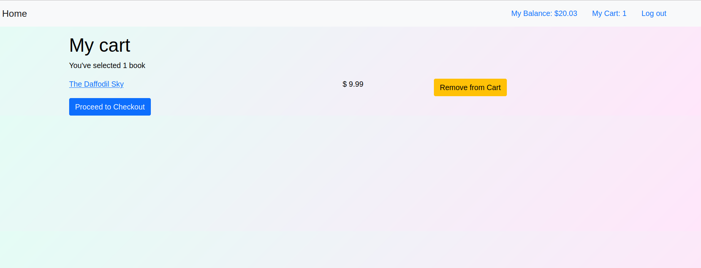

# :book: Book House

> An online book store where buyers can browse and buy from a collection of books offered by registered sellers.

## Built With

- Ruby v3.0.0
- Ruby on Rails v6.1.4

## Live Demo

Check the [live version](https://young-headland-11088.herokuapp.com/) of the app!

## Getting Started

To get a local copy up and running follow these simple example steps.

### Prerequisites

- Ruby on Rails v6.x. To learn how to install Ruby on Rails, please follow this [link](https://guides.rubyonrails.org/getting_started.html)
- Postgres

### Setup

- Clone this repository using the link above (click on the 'code' button)
- Open a terminal and `cd` to the cloned repository
- run `bundle install` to install the dependencies
- run `rails db:create`
- run `rails db:migrate`
- run `rails db:seed`

### Local Development

- Open a terminal and start a server with `rails s`
- Open another terminal and start redis with `redis-server`
- Open `http://localhost:3000/` in your browser.

### Usage

#### For sellers
- Sign up as a seller by providing a name, email, phone and password
- Publish books for sale
- See your earnings grow with the sales!

#### For buyers
- Sign up as a buyer by providing a name, email, address and password
- You'll receive $50 after signing up!
- Start browsing books and add them to your cart 
- Once you're ready, proceed to check out

### Run tests

Run `rspec -fd`

### Deployment

- Deployed in Heroku

## License

This project is [MIT](LICENSE) licensed.

## Contribute

Issues and feature requests are welcome on the [issues page](https://github.com/aliciapaz/bookstore-rails/issues)